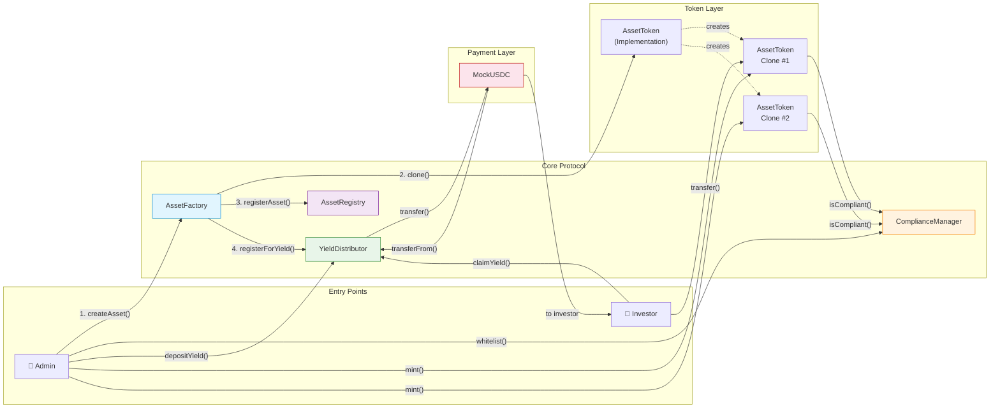
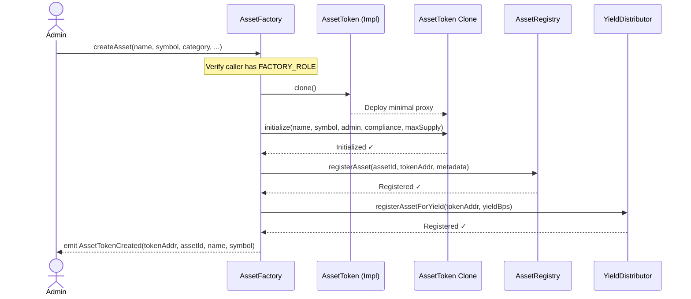
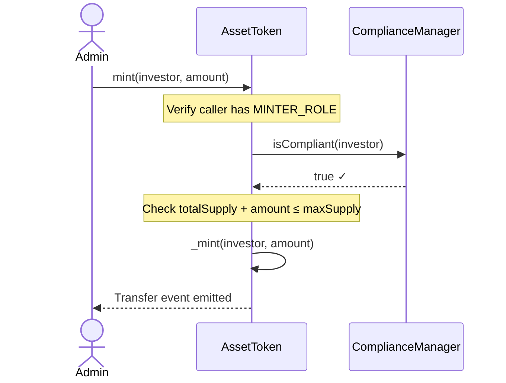
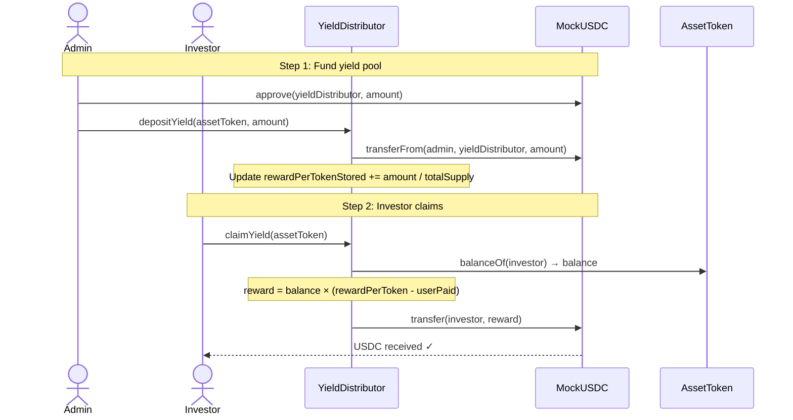
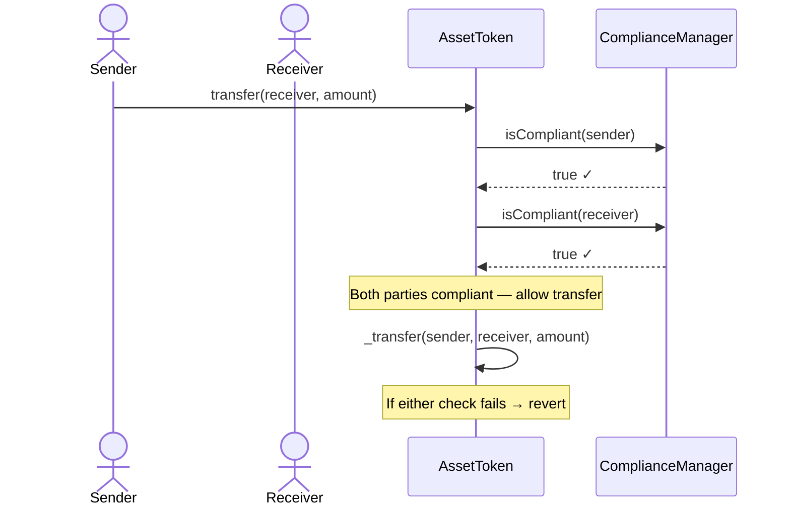
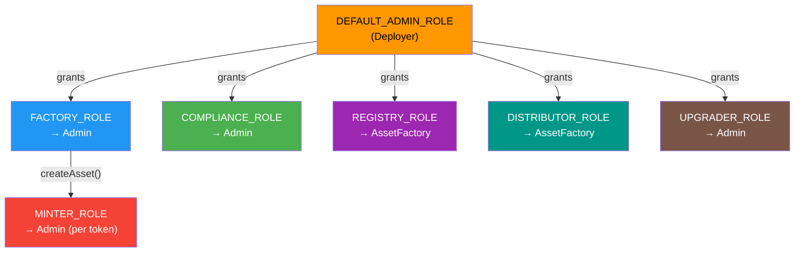
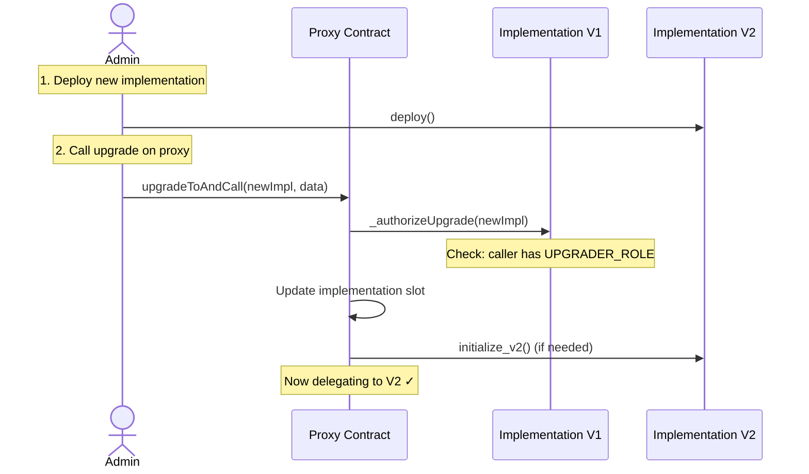

# 🏗️ Architecture — RWA Tokenization Platform

This document provides a detailed technical overview of the system architecture, contract interactions, data flows, role-based access model, and upgrade strategy.

---

## Table of Contents

- [System Overview](#system-overview)
- [Contract Interaction Diagram](#contract-interaction-diagram)
- [Core Contracts](#core-contracts)
- [Data Flows](#data-flows)
  - [Asset Creation Flow](#1-asset-creation-flow)
  - [Token Minting Flow](#2-token-minting-flow)
  - [Yield Distribution Flow](#3-yield-distribution-flow)
  - [Compliance Checking Flow](#4-compliance-checking-flow)
- [Role-Based Access Control Matrix](#role-based-access-control-matrix)
- [Upgrade Path Documentation](#upgrade-path-documentation)
- [Storage Layout Considerations](#storage-layout-considerations)

---

## System Overview

The RWA Tokenization Platform is designed as a modular, upgradeable system of smart contracts that work together to tokenize, manage, and yield-distribute real-world assets. The architecture follows these core principles:

| Principle | Implementation |
|---|---|
| **Separation of Concerns** | Each contract has a single responsibility (compliance, registry, yield, etc.) |
| **Upgradeability** | All core contracts use the UUPS proxy pattern for safe upgrades |
| **Minimal Trust** | Role-based access control limits each contract to only the permissions it needs |
| **Factory Pattern** | New asset tokens are created through a central factory that orchestrates multi-contract setup |
| **Compliance by Default** | Token transfers are blocked unless both sender and receiver pass compliance checks |

---

## Contract Interaction Diagram



---

## Core Contracts

### MockUSDC

- **Type**: Standard ERC-20 (not upgradeable)
- **Decimals**: 6 (mirrors real USDC)
- **Purpose**: Test stablecoin for yield payments
- **Key Function**: `mint(address to, uint256 amount)` — public, for testing only

### ComplianceManager

- **Type**: UUPS Upgradeable Proxy
- **Purpose**: KYC/AML whitelist registry that gates all asset token transfers
- **Storage**:
  - `mapping(address => bool) whitelisted` — address whitelist status
  - `mapping(address => bool) kycVerified` — KYC verification status
- **Key Functions**:
  - `whitelistAddress(address)` — Add to whitelist (requires `COMPLIANCE_ROLE`)
  - `verifyKYC(address)` — Mark as KYC verified (requires `COMPLIANCE_ROLE`)
  - `isCompliant(address) → bool` — Check if address is both whitelisted and KYC verified

### YieldDistributor

- **Type**: UUPS Upgradeable Proxy
- **Purpose**: Accumulates USDC yield and distributes proportionally to token holders
- **Pattern**: Global reward accumulator (`rewardPerTokenStored`) per asset
- **Storage**:
  - `mapping(address => uint256) rewardPerTokenStored` — per-asset accumulator
  - `mapping(address => mapping(address => uint256)) userRewardPerTokenPaid` — per-user checkpoint
  - `mapping(address => mapping(address => uint256)) rewards` — pending rewards per user per asset
- **Key Functions**:
  - `depositYield(address assetToken, uint256 amount)` — Deposit USDC yield for an asset
  - `claimYield(address assetToken)` — Investor claims their proportional share
  - `earned(address assetToken, address account) → uint256` — View pending rewards

### AssetToken (Implementation)

- **Type**: Standard deploy (implementation contract for cloning)
- **Purpose**: ERC-20 token representing fractional ownership of one real-world asset
- **Features**:
  - Transfer hooks check `ComplianceManager` for sender/receiver compliance
  - `MINTER_ROLE` required to mint new tokens
  - Capped at `maxTokenSupply`
- **Key Functions**:
  - `mint(address to, uint256 amount)` — Mint tokens (requires `MINTER_ROLE`)
  - `_update(...)` — Overridden to enforce compliance on every transfer

### AssetRegistry

- **Type**: UUPS Upgradeable Proxy
- **Purpose**: On-chain catalog of all tokenized assets
- **Storage**:
  - `mapping(uint256 => AssetInfo) assets` — asset metadata by ID
  - `uint256 assetCount` — total number of registered assets
- **Key Functions**:
  - `registerAsset(...)` — Add new asset (requires `REGISTRY_ROLE`)
  - `getAsset(uint256 assetId) → AssetInfo` — Query asset metadata

### AssetFactory

- **Type**: UUPS Upgradeable Proxy
- **Purpose**: Orchestrates end-to-end creation of new tokenized assets
- **Key Functions**:
  - `createAsset(name, symbol, category, valuation, maxTokenSupply, yieldBasisPoints, metadataURI)` — Creates token clone, registers in registry, configures yield. Requires `FACTORY_ROLE`.
- **Events**:
  - `AssetTokenCreated(address tokenAddress, uint256 assetId, string name, string symbol)`

---

## Data Flows

### 1. Asset Creation Flow



### 2. Token Minting Flow



### 3. Yield Distribution Flow



### 4. Compliance Checking Flow



---

## Role-Based Access Control Matrix

| Role | Hash | Contract(s) | Granted To | Allows |
|---|---|---|---|---|
| `DEFAULT_ADMIN_ROLE` | `0x00` | All | Deployer | Grant/revoke any role; upgrade contracts |
| `FACTORY_ROLE` | `keccak256("FACTORY_ROLE")` | AssetFactory | Admin | Call `createAsset()` |
| `REGISTRY_ROLE` | `keccak256("REGISTRY_ROLE")` | AssetRegistry | AssetFactory | Call `registerAsset()` |
| `COMPLIANCE_ROLE` | `keccak256("COMPLIANCE_ROLE")` | ComplianceManager | Admin | Whitelist and KYC-verify addresses |
| `DISTRIBUTOR_ROLE` | `keccak256("DISTRIBUTOR_ROLE")` | YieldDistributor | AssetFactory | Register new assets for yield distribution |
| `MINTER_ROLE` | `keccak256("MINTER_ROLE")` | AssetToken | Factory / Admin | Mint asset tokens to investors |
| `UPGRADER_ROLE` | `keccak256("UPGRADER_ROLE")` | All UUPS | Admin | Authorize UUPS proxy upgrades |

### Role Relationship Diagram



---

## Upgrade Path Documentation

### UUPS Proxy Pattern

All core contracts (except MockUSDC and AssetToken implementation) use the **Universal Upgradeable Proxy Standard (UUPS)** defined in [EIP-1822](https://eips.ethereum.org/EIPS/eip-1822).

**Why UUPS over Transparent Proxy?**

| Feature | UUPS | Transparent Proxy |
|---|---|---|
| Gas cost per call | Lower (no admin check) | Higher (proxy checks msg.sender) |
| Upgrade logic location | In implementation | In proxy |
| Accidental lock-out risk | Possible (mitigated by UPGRADER_ROLE) | Lower |
| Contract size impact | Slightly larger implementation | Larger proxy |

### Upgrade Procedure



### Upgrade Checklist

1. ✅ Verify `UPGRADER_ROLE` is held only by trusted addresses
2. ✅ New implementation inherits from the same base contracts
3. ✅ New implementation does **not** modify existing storage variable order
4. ✅ New storage variables are **appended** to the end only
5. ✅ Run `hardhat upgrade --validate` to check storage compatibility
6. ✅ Test upgrade on a fork before mainnet
7. ✅ New implementation includes `_authorizeUpgrade` with proper access control

---

## Storage Layout Considerations

### Rules for UUPS Upgradeable Storage

UUPS proxies use `delegatecall`, meaning the proxy contract holds all state. The implementation contract defines the storage layout. Violating storage layout rules can corrupt state.

#### ✅ DO

- **Append-only**: Add new state variables after all existing ones
- **Use storage gaps**: Reserve slots for future use

  ```solidity
  // Reserve 50 slots for future upgrades
  uint256[50] private __gap;
  ```

- **Use `@openzeppelin/contracts-upgradeable`**: These contracts include proper storage gaps
- **Use `initializer` instead of `constructor`**: Constructors don't run in proxy context

#### ❌ DON'T

- **Reorder** existing state variables
- **Remove** or **rename** state variables
- **Change types** of existing variables (e.g., `uint128` to `uint256`)
- **Insert** new variables between existing ones
- **Use `immutable`** state variables (they're stored in bytecode, not proxy storage)

### Storage Slot Map Example

```
Slot 0:    _initialized (uint8) + _initializing (bool)     [Initializable]
Slot 1-50: AccessControlUpgradeable storage                 [inherited]
Slot 51:   ReentrancyGuard _status                          [inherited]
Slot 52:   Custom storage variable 1                         [contract-specific]
Slot 53:   Custom storage variable 2                         [contract-specific]
...
Slot N-50 to N: __gap[50]                                   [reserved for upgrades]
```

### Verifying Storage Compatibility

Use the OpenZeppelin Upgrades plugin to validate storage layout before deploying an upgrade:

```bash
# The plugin automatically validates storage when upgrading
npx hardhat run scripts/upgrade.ts --network localhost
```

The plugin will throw an error if:
- Storage variables have been reordered
- Variables have been removed or had their types changed
- New variables were inserted before existing ones

---

> **Next**: See [SECURITY.md](SECURITY.md) for the full threat model and audit checklist.
