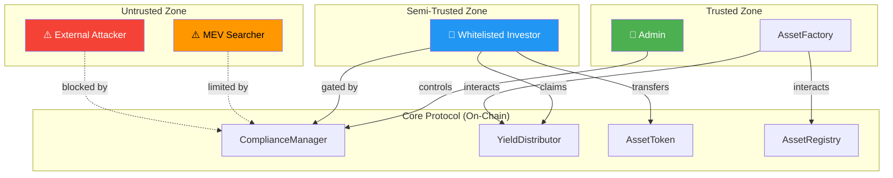
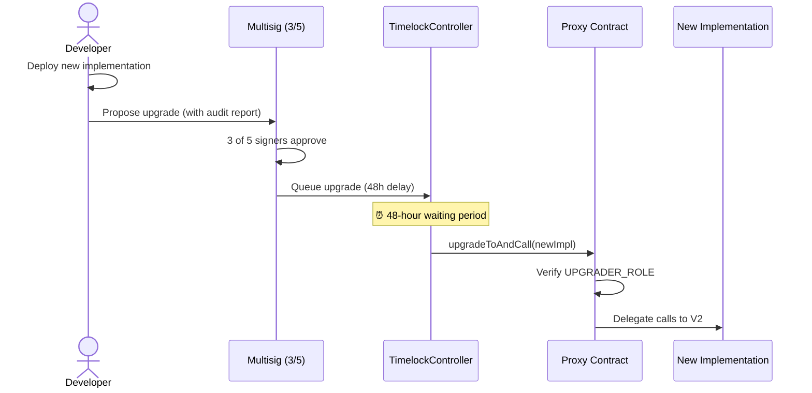

# 🔒 Security — RWA Tokenization Platform

This document outlines the threat model, attack vectors with mitigations, audit checklist, and security best practices followed throughout the platform.

---

## Table of Contents

- [Threat Model](#threat-model)
- [Attack Vectors and Mitigations](#attack-vectors-and-mitigations)
  - [1. Reentrancy Attacks](#1-reentrancy-attacks)
  - [2. Access Control Violations](#2-access-control-violations)
  - [3. Integer Overflow / Underflow](#3-integer-overflow--underflow)
  - [4. Front-Running / MEV](#4-front-running--mev)
  - [5. Reward Manipulation](#5-reward-manipulation)
  - [6. Flash Loan Attacks](#6-flash-loan-attacks)
  - [7. Upgrade Security](#7-upgrade-security)
  - [8. Denial of Service](#8-denial-of-service)
  - [9. Centralization Risks](#9-centralization-risks)
- [Audit Checklist](#audit-checklist)
- [Best Practices Followed](#best-practices-followed)

---

## Threat Model

### Assets at Risk

| Asset | Value Type | Impact of Compromise |
|---|---|---|
| **USDC in YieldDistributor** | Financial | Direct loss of yield funds |
| **Asset Token balances** | Ownership | Unauthorized ownership transfer |
| **Compliance whitelist** | Regulatory | Non-compliant actors gain access |
| **Admin role keys** | Control | Full platform compromise |
| **Upgrade authority** | Control | Malicious implementation swap |

### Threat Actors

| Actor | Motivation | Capability |
|---|---|---|
| **External attacker** | Financial gain | Contract interaction, flash loans, MEV |
| **Malicious investor** | Extra yield, bypass compliance | Whitelisted account holder |
| **Compromised admin** | Rug pull, data manipulation | Elevated role access |
| **MEV searcher** | Profit extraction | Transaction ordering, sandwich attacks |

### Trust Boundaries



---

## Attack Vectors and Mitigations

### 1. Reentrancy Attacks

**Threat**: An attacker exploits external calls (e.g., `claimYield()` → USDC transfer) to re-enter the contract and drain funds.

**Mitigations**:

| Layer | Implementation |
|---|---|
| **ReentrancyGuard** | `YieldDistributor` inherits `ReentrancyGuardUpgradeable` — all mutating functions use the `nonReentrant` modifier |
| **CEI Pattern** | All state changes occur **before** external calls (Checks-Effects-Interactions) |
| **Safe Token Standard** | USDC is a standard ERC-20; `transfer`/`transferFrom` do not trigger fallback hooks |

**Example — CEI in claimYield()**:

```solidity
function claimYield(address assetToken) external nonReentrant {
    // CHECK: calculate reward
    uint256 reward = earned(assetToken, msg.sender);
    require(reward > 0, "No rewards");

    // EFFECT: zero out rewards before transfer
    rewards[assetToken][msg.sender] = 0;
    userRewardPerTokenPaid[assetToken][msg.sender] = rewardPerTokenStored[assetToken];

    // INTERACTION: transfer USDC (after state update)
    IERC20(usdcToken).transfer(msg.sender, reward);
}
```

**Risk Level**: 🟢 **LOW** — Fully mitigated by ReentrancyGuard + CEI + standard ERC-20.

---

### 2. Access Control Violations

**Threat**: Unauthorized callers invoke privileged functions (minting, whitelisting, upgrading).

**Mitigations**:

| Control | Description |
|---|---|
| **OpenZeppelin RBAC** | `AccessControlUpgradeable` enforces role checks on every protected function |
| **Granular Roles** | Each action has a dedicated role (`MINTER_ROLE`, `COMPLIANCE_ROLE`, etc.) |
| **No Public Admin** | `DEFAULT_ADMIN_ROLE` is only assigned to the deployer |
| **Principle of Least Privilege** | Contracts only receive the specific roles they need |

**Role Isolation**:

```
AssetFactory   → REGISTRY_ROLE (on AssetRegistry)
               → DISTRIBUTOR_ROLE (on YieldDistributor)
               ✗ Cannot whitelist, cannot mint directly, cannot upgrade

Admin          → FACTORY_ROLE (on AssetFactory)
               → COMPLIANCE_ROLE (on ComplianceManager)
               ✗ Cannot register assets directly, must go through factory
```

**Risk Level**: 🟢 **LOW** — Battle-tested OpenZeppelin implementation with granular role separation.

---

### 3. Integer Overflow / Underflow

**Threat**: Arithmetic operations produce incorrect results, leading to incorrect balances or yields.

**Mitigations**:

| Control | Description |
|---|---|
| **Solidity 0.8.24** | Built-in checked arithmetic — all overflows/underflows automatically revert |
| **No `unchecked` blocks** | Platform code does not use `unchecked` blocks for critical math |
| **Safe Casting** | Type conversions are validated |

**Yield Calculation Safety**:

```solidity
// rewardPerToken = accumulated + (newYield * PRECISION / totalSupply)
// Using uint256 with 1e18 precision — overflow at ~1.15e59 USDC, effectively impossible
```

**Risk Level**: 🟢 **LOW** — Language-level protection with no dangerous overrides.

---

### 4. Front-Running / MEV

**Threat**: MEV searchers observe pending transactions and extract value through sandwich attacks or front-running.

**Attack Scenarios**:

| Scenario | Description | Risk |
|---|---|---|
| **Yield deposit front-run** | Attacker buys tokens before yield deposit, claims, sells | 🟡 Medium |
| **Compliance bypass** | Attacker front-runs whitelist removal | 🟢 Low |
| **Token price manipulation** | Sandwich attack on DEX trades | 🟡 Medium |

**Mitigations**:

| Control | Effectiveness |
|---|---|
| **Compliance whitelist** | Only pre-approved addresses can hold tokens — random MEV bots cannot participate |
| **Accumulator pattern** | Rewards accrue based on historical holdings, not just at snapshot time |
| **No on-chain AMM** | Asset tokens are not traded on AMMs in the core protocol, reducing sandwich attack surface |
| **Time-weighted positions** | The reward accumulator naturally favors long-term holders over just-in-time positions |

**Residual Risk**: Whitelisted actors could theoretically front-run yield deposits, but the accumulator pattern makes this economically marginal.

**Risk Level**: 🟡 **MEDIUM** — Structurally mitigated by compliance gates and accumulator pattern, but whitelisted MEV is theoretically possible.

---

### 5. Reward Manipulation

**Threat**: An attacker games the yield distribution system to claim more than their fair share.

**Attack Scenarios**:

| Attack | Description |
|---|---|
| **Double-claim** | Claim rewards, transfer tokens, claim again at new address |
| **Just-in-time liquidity** | Buy tokens right before yield deposit, claim, sell |
| **Accumulator desync** | Exploit rounding errors to extract dust amounts repeatedly |

**Mitigations**:

| Control | Description |
|---|---|
| **Accumulator pattern** | `rewardPerTokenStored` tracks cumulative yield per token unit; new depositors start from current checkpoint, not zero |
| **Checkpoint on transfer** | `_update()` hook checkpoints both sender's and receiver's rewards before any balance change |
| **Single claim** | After claiming, user's `userRewardPerTokenPaid` is updated to current, zeroing out further claims |

**How the Accumulator Works**:

```
Time 0: rewardPerToken = 0
        Alice has 100 tokens, Bob has 0

Time 1: 1000 USDC deposited, totalSupply = 100
        rewardPerToken = 0 + (1000 / 100) = 10
        Alice earned = 100 * (10 - 0) = 1000 ✓

Time 2: Bob buys 50 tokens from Alice
        → Checkpoint: Alice's pending = 1000, Bob's paid = 10 (current)
        Alice has 50, Bob has 50

Time 3: 750 USDC deposited, totalSupply = 100
        rewardPerToken = 10 + (750 / 100) = 17.5
        Alice earned = 1000 + 50 * (17.5 - 10) = 1375
        Bob earned = 0 + 50 * (17.5 - 10) = 375
        Total = 1750 ✓ (1000 + 750)
```

**Risk Level**: 🟢 **LOW** — Accumulator pattern is mathematically sound and prevents gaming.

---

### 6. Flash Loan Attacks

**Threat**: Attacker borrows a large amount via flash loan, temporarily holds asset tokens, claims yield, and repays in a single transaction.

**Why This Fails**:

| Barrier | Description |
|---|---|
| **Compliance whitelist** | Flash loan contracts are not whitelisted — tokens cannot be transferred to them |
| **KYC requirement** | Every holder must pass KYC — anonymous flash loan contracts cannot |
| **No AMM liquidity** | Asset tokens are not available on flash-loan-compatible DEXs in the core protocol |
| **Accumulator timing** | Even if tokens were acquired, accumulator would checkpoint at acquisition, yielding zero for a same-block claim |

**Risk Level**: 🟢 **LOW** — Multiple independent barriers prevent flash loan exploitation.

---

### 7. Upgrade Security

**Threat**: A compromised admin deploys a malicious implementation that steals funds or corrupts state.

**Mitigations**:

| Control | Description |
|---|---|
| **UPGRADER_ROLE** | Only addresses with explicit `UPGRADER_ROLE` can authorize upgrades |
| **Role separation** | `UPGRADER_ROLE` can be separated from `DEFAULT_ADMIN_ROLE` in production |
| **Timelock** (recommended) | Deploy a timelock controller as the upgrade authority for mainnet |
| **Multisig** (recommended) | Use a Gnosis Safe multisig as the `UPGRADER_ROLE` holder |
| **Storage validation** | OpenZeppelin Upgrades plugin validates storage layout compatibility |
| **`_disableInitializers()`** | Implementation constructors call this to prevent initialization hijacking |

**Production Upgrade Flow (Recommended)**:



**Risk Level**: 🟡 **MEDIUM** — Inherent to upgradeable contracts. Mitigated by multisig + timelock in production.

---

### 8. Denial of Service

**Threat**: Attacker prevents legitimate users from interacting with the platform.

| Vector | Mitigation |
|---|---|
| **Block gas limit** | No unbounded loops in any contract function |
| **Griefing via failed transfers** | USDC transfers are simple — no callback hooks to exploit |
| **Storage spam** | Only whitelisted addresses can trigger state writes |
| **Front-running removal** | Admin can re-whitelist; compliance changes are admin-gated |

**Risk Level**: 🟢 **LOW** — No unbounded operations; whitelisting limits interaction surface.

---

### 9. Centralization Risks

**Threat**: Excessive admin power creates a single point of failure or rug-pull risk.

**Current State** (Development):

| Risk | Current | Production Recommendation |
|---|---|---|
| **Single admin** | Deployer EOA | Replace with multisig |
| **Instant upgrades** | No delay | Add 48h timelock |
| **Compliance control** | Single authority | Distribute to compliance committee |
| **Yield deposits** | Admin-controlled | Automate via oracle/keeper |

**Decentralization Roadmap**:

1. **Phase 1** — Deploy with multisig admin (Gnosis Safe)
2. **Phase 2** — Add timelock controller for upgrades
3. **Phase 3** — Governance token for protocol parameters
4. **Phase 4** — Decentralized compliance oracle network

**Risk Level**: 🟡 **MEDIUM** — Acceptable for development; must be addressed before production.

---

## Audit Checklist

### Smart Contract Audit

| # | Check | Status | Notes |
|---|---|---|---|
| 1 | All external/public functions have access control | ✅ | RBAC on all mutating functions |
| 2 | Reentrancy guards on functions with external calls | ✅ | `nonReentrant` on `YieldDistributor` |
| 3 | CEI pattern followed | ✅ | State updates before external calls |
| 4 | No unbounded loops | ✅ | All iterations are bounded |
| 5 | Integer arithmetic is safe | ✅ | Solidity 0.8+ checked math |
| 6 | Return values of external calls checked | ✅ | Using SafeERC20 or checked transfers |
| 7 | Events emitted for all state changes | ✅ | Events on create, mint, yield, compliance |
| 8 | Initializers cannot be called twice | ✅ | `initializer` modifier + `_disableInitializers()` |
| 9 | Storage layout is upgrade-safe | ✅ | Append-only with `__gap` reservations |
| 10 | No `selfdestruct` or `delegatecall` to untrusted | ✅ | Not used anywhere |
| 11 | Proxy admin cannot call implementation directly | ✅ | UUPS pattern (no proxy admin) |
| 12 | `_authorizeUpgrade` checks `UPGRADER_ROLE` | ✅ | On all UUPS contracts |
| 13 | Token decimals consistent | ✅ | USDC = 6 decimals, AssetToken = 18 |
| 14 | No floating pragma | ✅ | Locked to `0.8.24` |
| 15 | License identifier present | ✅ | `SPDX-License-Identifier: MIT` |

### Deployment Audit

| # | Check | Status |
|---|---|---|
| 1 | Constructor args verified | ✅ |
| 2 | Proxy initialization params correct | ✅ |
| 3 | All roles granted to correct addresses | ✅ |
| 4 | No roles granted to zero address | ✅ |
| 5 | Admin is not a contract (unless multisig) | ✅ |
| 6 | Deployed addresses saved and verified | ✅ |

### Operational Audit

| # | Check | Frequency |
|---|---|---|
| 1 | Monitor for unexpected role grants | Continuous |
| 2 | Verify upgrade proposals match audited code | Per upgrade |
| 3 | Audit trail of compliance changes | Weekly |
| 4 | Yield distribution reconciliation | Per distribution |
| 5 | Private key rotation for admin | Quarterly |

---

## Best Practices Followed

### Solidity Best Practices

| Practice | Implementation |
|---|---|
| **Use latest stable compiler** | Solidity 0.8.24 |
| **Lock pragma version** | `pragma solidity ^0.8.24;` |
| **Use OpenZeppelin contracts** | All base contracts from OZ v5.1 |
| **Emit events for state changes** | All mutations emit indexed events |
| **Use custom errors** | Gas-efficient error handling |
| **NatSpec documentation** | All public functions documented |
| **Explicit visibility** | All functions have declared visibility |
| **Minimal contract size** | Below 24KB limit, optimizer enabled |

### Security Best Practices

| Practice | Implementation |
|---|---|
| **Principle of Least Privilege** | Each contract has minimal required roles |
| **Defense in Depth** | Multiple barriers (compliance + RBAC + reentrancy guard) |
| **Fail-Safe Defaults** | Non-whitelisted addresses blocked by default |
| **Separation of Concerns** | Each contract has a single responsibility |
| **Checks-Effects-Interactions** | State updates before external calls |
| **Pull over Push** | Investors `claimYield()` rather than receiving automatic pushes |
| **No Magic Numbers** | Constants defined and documented |

### Development Best Practices

| Practice | Implementation |
|---|---|
| **Comprehensive testing** | Unit, integration, and scenario tests |
| **Gas reporting** | Hardhat gas reporter enabled |
| **Contract sizing** | Size checked against 24KB limit |
| **CI/CD pipeline** | Automated test runs on commit |
| **Code coverage** | Coverage reports generated |
| **Deployment scripts** | Automated, repeatable deployments |
| **Address persistence** | Deployed addresses saved to JSON |

---

> **Related Documents**:
> - [Architecture Overview](ARCHITECTURE.md)
> - [Main README](../README.md)
